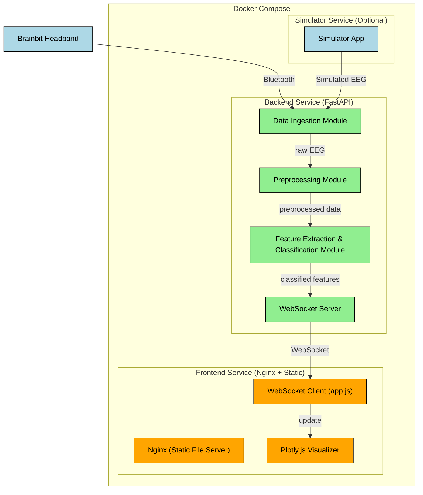

# EEG Data Analysis and Visualization System

A real-time EEG data analysis and visualization system that processes brainwave data from the Brainbit Headband, performs feature extraction and classification, and displays the results through an interactive web interface.

## Features

- Real-time EEG data acquisition via Bluetooth
- Signal preprocessing and feature extraction
- Emotion/Anxiety state classification
- Interactive data visualization using Plotly.js
- WebSocket-based real-time updates
- Docker containerization for easy deployment

## System Architecture

The system consists of two main components:

### Backend (FastAPI)
- EEG data extraction and preprocessing
- Feature extraction (Delta, Theta, Alpha, Beta power bands)
- Classification of emotional states
- WebSocket server for real-time data streaming

### Frontend (HTML/CSS/JavaScript)
- Real-time data visualization using Plotly.js
- Interactive bar charts for power band distribution
- Time-series line charts
- Visual status indicators
- Automatic WebSocket reconnection

## Prerequisites

- Docker and Docker Compose
- Python 3.9+ (for local development)
- Brainbit Headband and SDK (for actual EEG data)

## System Design



## Installation

1. Clone the repository:
```bash
git clone https://github.com/jeff14994/EEG-Detection.git
cd eeg_app
```

2. Build and start the containers:
```bash
docker-compose up --build
```

The application will be available at:
- Frontend: http://localhost
- Backend API: http://localhost:8000

## Development

### Backend Development

1. Navigate to the backend directory:
```bash
cd backend
```

2. Create a virtual environment and install dependencies:
```bash
python3.11 -m venv venv 
source venv/bin/activate # On Windows: venv\Scripts\activate 
pip3 install -r ./backend/requirements.txt
```

3. Run the development server:
```bash
uvicorn app.main:app --reload
```

### Frontend Development

The frontend consists of static files that can be served by any web server. For local development:

1. Navigate to the frontend directory:
```bash
cd frontend/public
```

2. Use any local web server to serve the files. For example, with Python:
```bash
python -m http.server 8001
```

Then access the frontend at http://localhost:8001

## Project Structure

```
.
├── backend/
│   ├── app/
│   │   ├── __init__.py          # FastAPI app initialization
│   │   ├── main.py              # Main app logic and WebSocket
│   │   ├── eeg_data.py          # EEG data extraction
│   │   ├── preprocess.py        # Data preprocessing
│   │   └── classify.py          # Classification model
│   ├── requirements.txt         # Python dependencies
│   └── Dockerfile               # Backend container setup
│
├── frontend/
│   ├── public/
│   │   ├── index.html          # Main HTML file
│   │   ├── styles.css          # CSS styles
│   │   └── app.js              # JavaScript logic
│   ├── Dockerfile              # Frontend container setup
│   └── nginx.conf              # Nginx configuration
│
└── docker-compose.yml          # Service orchestration
```

## API Documentation

The backend API provides the following endpoints:

- `GET /`: Health check endpoint
- `WS /ws/eeg_data`: WebSocket endpoint for real-time EEG data

WebSocket data format:
```json
{
  "features": {
    "delta_power": float,
    "theta_power": float,
    "alpha_power": float,
    "beta_power": float
  },
  "emotion": "calm" | "anxious",
  "timestamp": "ISO-8601 timestamp"
}
```

## Contributing

1. Fork the repository
2. Create your feature branch (`git checkout -b feature/AmazingFeature`)
3. Commit your changes (`git commit -m 'Add some AmazingFeature'`)
4. Push to the branch (`git push origin feature/AmazingFeature`)
5. Open a Pull Request

## License

This project is licensed under the MIT License - see the LICENSE file for details.

## Acknowledgments

- Brainbit SDK for EEG data acquisition
- FastAPI for the backend framework
- Plotly.js for data visualization
- Scikit-learn for machine learning components 